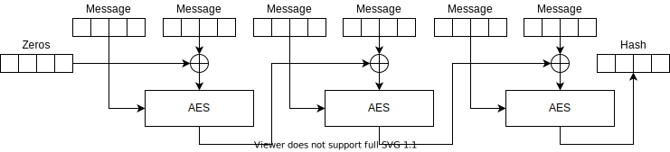
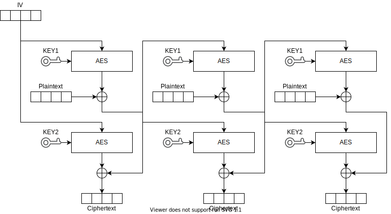

General information
-------------------

Bootloader is as small as possible. It has two main functionalities:

 * Start App from flash
 * Download App to RAM and start it
   * The App in RAM is responsible for rest of the work, e.g. flashing app or bootloader, changing config
 
Application running from RAM has no ISR support.

Flash organization
------------------

FOR NRF51
```
                                                                           v--- fixed address e.g. 1024
| modified vect table | bootloader | ... padding ... | conf: name, aes_key | original vect table | rest of APP .... |

```
modified vect table:
 * RESET -> bootloader RESET
 * Initial SP -> bootloader Initial SP
 * rest of vector table unchanged

FOR NRF52
```
                                                                     v--- fixed address 4096
| bootloader with vect table | ... padding ... | conf: name, aes_key | APP with its vector table ... |
```

bootloader is located at the region protected by PROTREG0 bit.

FOR SOFTDEVICE (both 51 and 52)

Bootloader is injected into unused space of MBR with reset vector patched to point to Recovery Bootloader.
Original reset vector of MBR is called if Recovery Bootloader was not activated.
Application and standard bootloader does not need special handling of Recovery Bootloader.

First stage communication example
---------------------------------
```
[programmer]    [devide]

{start discovery clicked}
send catch
wait
send catch
wait
send catch
wait
                power on
send catch
wait
send catch      {received}
wait            wait random
{receive error} send caught
send catch      {received}
wait            wait random
{received}      send caught

sendBlock 0
sendBlock 1
....
sendBlock 84
getStatus
               missing block bitmap
sendBlock 3
sendBlock 27
getStatus
               ok
runRAMApp
```

If bootloader was not catched then do softreset.
    After softreset check reset reason and go directly to the app.

RAM APP Communication example
---------------------
```
[programmer]    [devide]

erase pages 0..3
                erase done
sendBlock 1                   // block 0 is send at the end of programming
...
sendBlock 31; get status
                ok / missing block bitmap / error
erase pages 4..7
                erase done
sendBlock 32
...
sendBlock 347; get status
                ok / missing block bitmap / error
check HASH of blocks 1..347
                ok / error
> run user event
run app
                > soft reset
run app
run app
run app
run app
```

Radio parameters
----------------

 *   2Mbit,
 *   5 byte addr (MAGIC value, different for each side)
 *   8 bit LENGTH
 *   no S0, S1
 *   3 byte CRC (including address)
 
Hash algorithm
--------------

Hash can be calculated by AES based hash (small footprint because of HW AES accelerator):
```
output[16] = 0
foreach block[32] from input (padding by previous value of block or 0 if input.len < 32)
    output = AES(key = block[0..15], plaintext = output ^ block[16..31])
```

[](https://kildom.github.io/drawio/#img%2FSAHF.svg)<br/>
**Simple AES-based Hash Function (SAHF)**.
    
Encryption
----------
*  Both parts have generated AES key = sha256(password & devide unique address)
    * it is devided into two parts: KEY1, KEY2
    * device unique address is placed in 'send catched'
* device genrates random connection id (96 bits) and counter start value (32 bits).
* all further packets will have following structure:
    * lower 2 bytes of counter in plain text
        (higher 2 bytes of counter other end have to predict based on cyclic property of lower 2 bytes)
    * ciphertext = AES_DCTF(IV = conn_id & counter, content & zeros)
        (if receiving part gets zeros != 0 then packet was corrupted)
        (total overhead for encryption and authentication of each packet 2 + zeros bytes)
* counter is increased on each request (retransmission and response use the same counter value)

AES_DCTF provides:
   * full data security
   * error propagation
   * can use used instead of both AES_CFB and AES_PECB
   * the same algorithm for encryption and decrition, but with inverted KEYs
```
AES1(...) with KEY1, AES2(...) with KEY2
C[0] = AES2(IV) ^ T[0] ; T[0] = AES1(IV) ^ P[0]
C[1] = AES2(T[0]) ^ T[1] ; T[1] = AES1(T[0]) ^ P[1]
C[2] = AES2(T[1]) ^ T[2] ; T[2] = AES1(T[1]) ^ P[2]
...
P[0] = AES1(IV) ^ T[0] ; T[0] = AES2(IV) ^ C[0]
P[1] = AES1(T[0]) ^ T[1] ; T[1] = AES2(T[0]) ^ C[1]
P[2] = AES1(T[1]) ^ T[2] ; T[2] = AES2(T[1]) ^ C[2]
````

Euqlivement:
```
   AES_DCTF_ENCRYPT(key, iv, plain) = AES_CTF_DECRYPT(key2, iv, AES_CTF_ENCRYPT(key1, iv, plain))
   AES_DCTF_DECRYPT(key, iv, cipher) = AES_CTF_DECRYPT(key1, iv, AES_CTF_ENCRYPT(key2, iv, cipher))
```

AES key is located at the end of bootloader's flash page (end of flash). It is programmed the same time as entire bootloader.

[](https://kildom.github.io/drawio/#img%2FDCFB.svg)<br/>
**Double Cipher Feedback (DCFB)** encryption and decryption.

>> Warning!!! Wrong name should be DCFB instead of DCTF

```c++

#include <stdint.h>
#include <stdlib.h>
#include <string.h>

// In header file
#define AES_DCTF_ENCRYPT 0
#define AES_DCTF_DECRYPT 48

// In C file
#define KEY 0
#define PT 16
#define CT 32

#define KEY1 0
#define PT1 16
#define CT1 32
#define KEY2 48
#define PT2 64
#define CT2 80

#define HASH_IN1 64
#define HASH_IN2 80
#define HASH_OUT 96

#define BUFFER_BYTES 112

static uint8_t aes_buffer[BUFFER_BYTES];

static void do_aes(uint8_t* data)
{
    ECB->ECBDATAPTR = (uint32_t)data;
    ECB->TASKS_STARTECB = 1;
    while (!ECB->EVENTS_ENDECB);
    ECB->EVENTS_ENDECB = 0;
}

static void do_xor(uint8_t* data, const uint8_t* source, size_t size)
{
    size_t i;
    for (i = 0; i < size; i++)
    {
        data[i] ^= source[i];
    }
}

static void aes_dctf_block(uint8_t* data, size_t size, uint32_t mode)
{
    uint8_t* buffer1 = &aes_buffer[KEY1 + mode];
    uint8_t* buffer2 = &aes_buffer[KEY2 - mode];
    do_aes(buffer1); // buffer1 contains key=first_key, plain=iv
    do_xor(data, &buffer1[CT], size);
    memcpy(&buffer1[PT], data, size);
    do_aes(buffer2); // buffer2 contains key=second_key, plain=iv
    do_xor(data, &buffer2[CT], size);
    memcpy(&buffer2[PT], &buffer1[PT], size);
}

void aes_dctf_key(const uint8_t* key)
{
    memcpy(&aes_buffer[KEY1], key, 16);
    memcpy(&aes_buffer[KEY2], &key[16], 16);
}

void aes_dctf(uint8_t* data, size_t size, uint32_t mode, const uint8_t* iv)
{
    memcpy(&aes_buffer[PT1], iv, 16);
    memcpy(&aes_buffer[PT2], iv, 16);
    while (size > 0)
    {
        size_t this_size = (size > 16) ? 16 : size;
        aes_dctf_block(data, this_size, mode);
        size -= this_size;
        data += this_size;
    }
}

static void aes_hash_block(const uint8_t* data, size_t size)
{
    memcpy(&aes_buffer[HASH_IN1], data, size);
    do_xor(&aes_buffer[HASH_IN2], &aes_buffer[HASH_OUT], 16);
    do_aes(&aes_buffer[HASH_IN1]);
}

void aes_hash(const uint8_t* data, size_t size, uint8_t* hash)
{
    memset(&aes_buffer[HASH_IN1], 0, 48);
    while (size > 0)
    {
        size_t this_size = (size > 32) ? 32 : size;
        aes_hash_block(data, this_size);
        size -= this_size;
        data += this_size;
    }
    memcpy(hash, &aes_buffer[HASH_OUT], 16);
}
```


[](https://kildom.github.io/drawio/#img%2FRecoveryBootPackets.svg)
